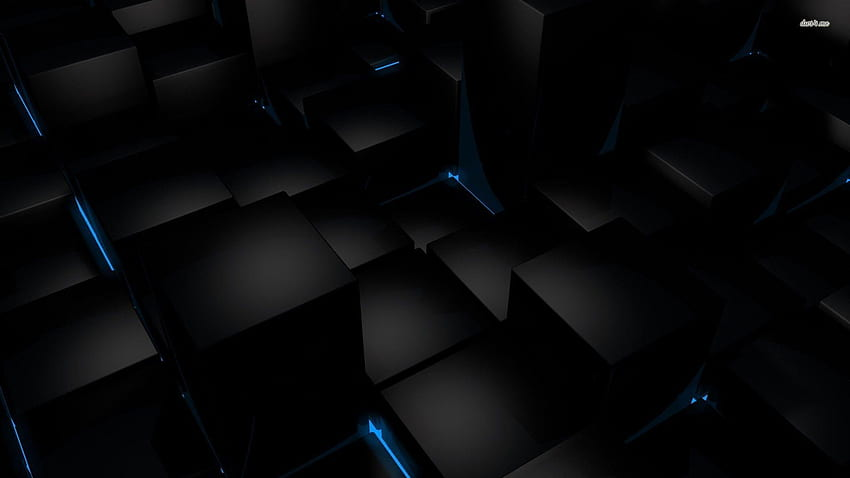

<style scoped>
  {
    background: linear-gradient(to bottom right, #70a1ff, #7f8c8d);
    background-image: url('images/code.jpg');
    background-size: 100% auto;
    color: #fff;
    font-family: 'Segoe UI', sans-serif;
    text-shadow: 2px 2px 4px rgba(0,0,0,0.6);
  }
  h1, h2, h3, h4, h5, h6 {
    color: #ffffff;
    font-weight: bold;
  }
  ul {
    list-style-type: none;
    padding-left: 1em;
  }
  img {
    max-width: 70%;
    margin: 0 auto;
    display: block;
    border-radius: 10px;
    box-shadow: 0 4px 8px rgba(0, 0, 0, 0.5);
  }
</style>

# GIT: Global Information Tracker


---

<style scoped>
  {
    background: linear-gradient(to bottom right, #70a1ff, #7f8c8d);
    background-image: url('images/background_image.jpg');
    color: #fff;
    font-family: 'Segoe UI', sans-serif;
    text-shadow: 2px 2px 4px rgba(0,0,0,0.6);
  }
</style>


# Inleiding
- **`Definitie van Git`**
- **`Functionaliteit`**
- **`Veiligheid`**
- **`Mogelijke datadiefstal`**


---

<style scoped>
  {
    background: linear-gradient(to bottom right, #70a1ff, #7f8c8d);
    color: #fff;
    font-family: 'Segoe UI', sans-serif;
    text-shadow: 2px 2px 4px rgba(0,0,0,0.6);
    background-size: % auto;
    display: flex;
    background-position: left center;
    color: #fff;
    font-family: 'Segoe UI', sans-serif;
    text-shadow: 2px 2px 4px rgba(0, 0, 0, 0.6);

  }
</style>


# Definitie

```Git is een gedistribueerd versiebeheersysteem voor het bijhouden van wijzigingen in broncode tijdens softwareontwikkeling.```


---

<style scoped>
  {
    background: linear-gradient(to bottom right, #70a1ff, #7f8c8d);
    color: #fff;
    font-family: 'Segoe UI', sans-serif;
    text-shadow: 2px 2px 4px rgba(0,0,0,0.6);
  }
</style>


# Git Voordelen

- **`Versiebeheer`**
- **`Samenwerking`**
- **`Branching en merging`**
- **`Lokale en externe opslag`**

---


<style scoped>
  {
    background: linear-gradient(to bottom right, #70a1ff, #7f8c8d);
    color: #fff;
    font-family: 'Segoe UI', sans-serif;
    text-shadow: 2px 2px 4px rgba(0,0,0,0.6);
  }
</style>


# Git Commando’s

- `git init`: ```Initialiseert een nieuwe Git-repository.```
- `git clone`:``` Haalt een kopie van een repository binnen.```
- `git add`: ```Voegt wijzigingen toe aan de staging area.```
- `git commit`: ```Commit wijzigingen aan de repository.```
- `git push`: ```Duwt lokale commits naar een externe repository.```
- `git pull`: ```Haalt wijzigingen op van een externe repository en integreert ze.```
- `git branch`: ```Creëert, bekijkt of verwijdert branches.```
- `git checkout`: ```Schakelt tussen branches of herstelt bestanden naar een vorige commit.```
- `git merge`: ```Voegt wijzigingen van een andere branch samen met de huidige branch.```
- `git status`: ```Geeft de status van de werkdirectory weer.```

---

<style scoped>
  {
    background: linear-gradient(to bottom right, #70a1ff, #7f8c8d);
    color: #fff;
    font-family: 'Segoe UI', sans-serif;
    text-shadow: 2px 2px 4px rgba(0,0,0,0.6);
  }
</style>


# Veiligheid

- **`Authenticatie en autorisatie`**
- **`Versleuteling van gegevens in transit en opslag`**
- **`Beperkte toegang tot repositories en branches`**

---

<style scoped>
  {
    background: linear-gradient(to bottom right, #70a1ff, #7f8c8d);
    color: #fff;
    font-family: 'Segoe UI', sans-serif;
    text-shadow: 2px 2px 4px rgba(0,0,0,0.6);
  }
</style>


# Data Risico's

- **```Broncode```**
- **```Gevoelige informatie in commits```**
- **```Toegangsreferenties tot repositories```**

"`Hoewel Git veiligheidsmaatregelen biedt, is er altijd een risico op datadiefstal, vooral bij onjuist geconfigureerde toegangsrechten of zwakke wachtwoorden.`"


